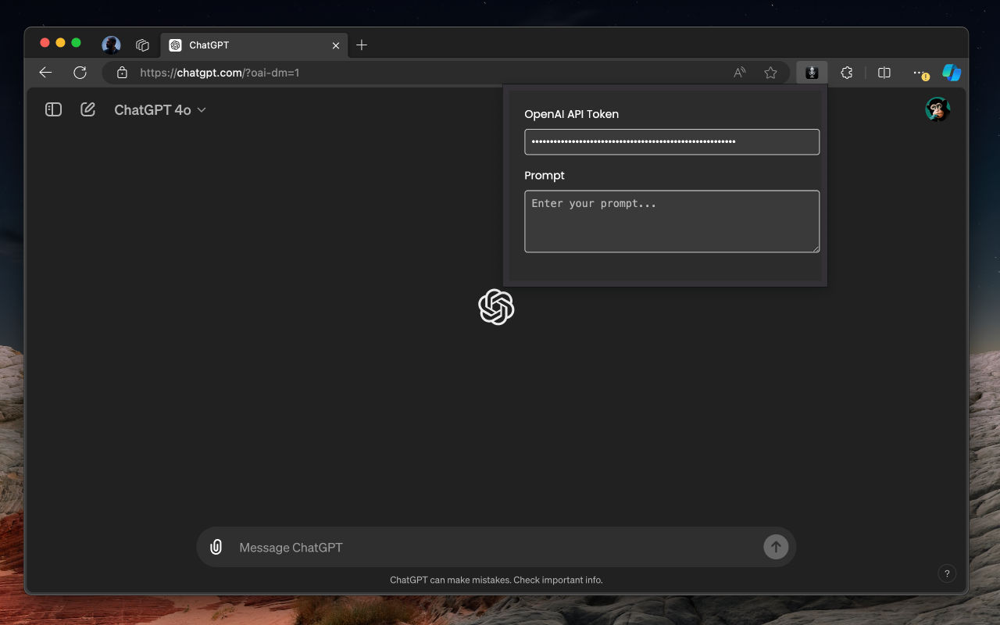
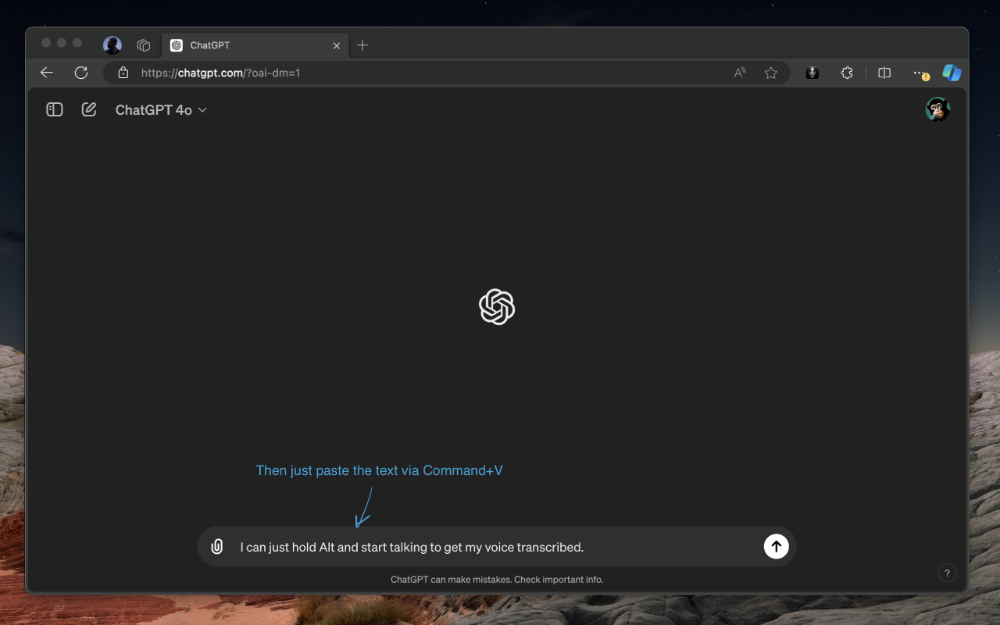
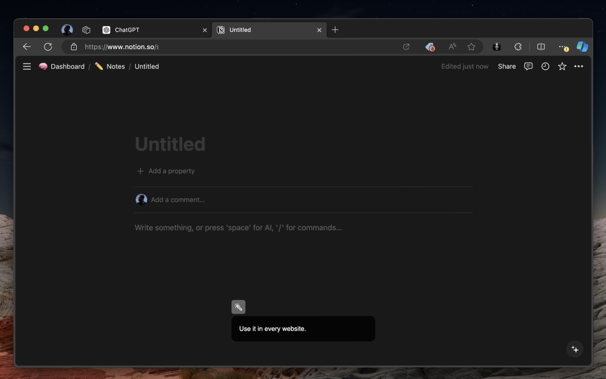

# Voice-to-Text Anywhere in Chrome with OpenAI Whisper API 🚀

Unlock the power of voice with our Chrome extension! Simply hold `Alt (or option)` key for a second to start and release to stop recording, and let OpenAI's Whisper API transcribe your voice, copying it your clipboard right after it. 🎉

### Screenshots 📸

<div style="display: flex;">
    
    
    
    
</div>

### Getting Started 🔧

Follow these steps to run the extension locally in Chrome:

1. **Clone the Repository:**  
   ```sh
   git clone https://github.com/sebastianmalcolm/whisper-anywhere.git
   ```
2. **Install Node Version Manager (nvm):**
   - Run the following command to install nvm:
     ```bash
     curl -o- https://raw.githubusercontent.com/nvm-sh/nvm/v0.39.5/install.sh | bash
     ```
   - Load nvm into your shell:
     ```bash
     export NVM_DIR="$HOME/.nvm"
     [ -s "$NVM_DIR/nvm.sh" ] && \. "$NVM_DIR/nvm.sh"  # This loads nvm
     ```

3. **Install the Node.js version specified in the .nvmrc file:**
   ```bash
   nvm install
   ```

4. **Install Dependencies:**  
   ```sh
   npm install  
   ```
5. **Build the App:**  
   ```sh
   npm run build
   ```
6. **Load the Extension in Chrome:**  
   - Open Chrome and navigate to `chrome://extensions`  
   - Enable "Developer mode" in the top-right corner  
   - Click "Load unpacked" and select the `build` folder
7. **Configure the Extension:** Click the extension's button (microphone icon) to set up.

### API Key Disclaimer 🔑

You'll need an OpenAI account with a valid API key. OpenAI provides free credits, which are sufficient to enjoy the extension's features.

#### Available Scripts

- `npm start`: Runs the app in development mode. Open [http://localhost:3000](http://localhost:3000) to view it in your browser.
- `npm run build`: Builds the app for production to the `build` folder.

For more information, refer to the [Create React App documentation](https://create-react-app.dev/docs/getting-started/) and [React documentation](https://facebook.github.io/create-react-app/docs/getting-started).

### Additional Information
For build instructions specific to the current branch of this codebase, see [README-Build_NodeJS-LTS.md](README-Build_NodeJS-LTS.md).
